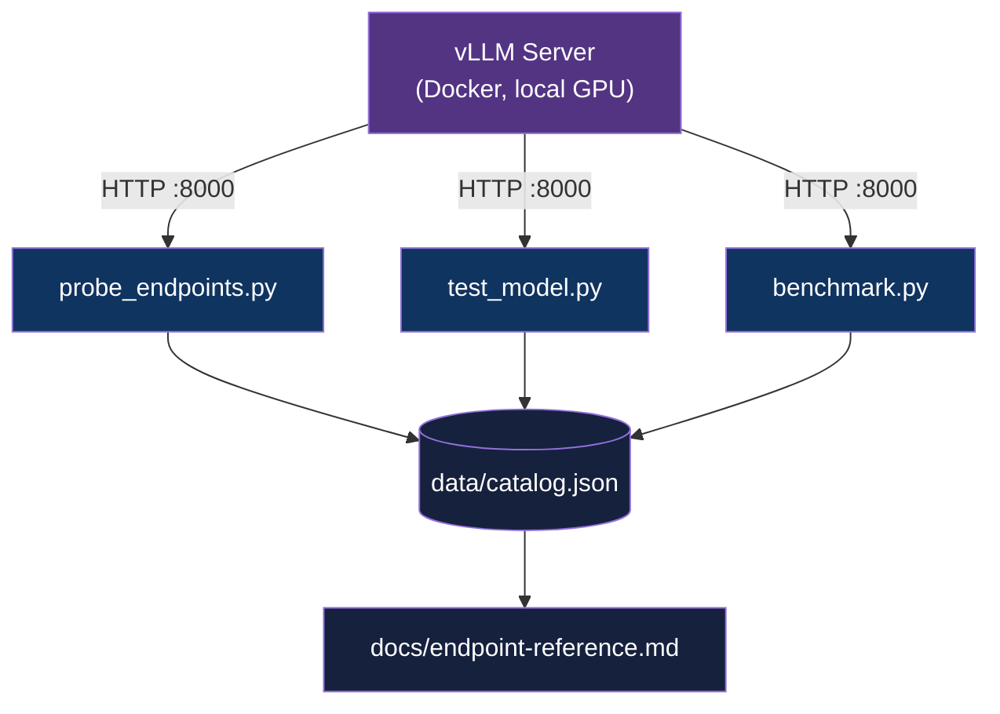

<div align="center">

# vllm-explorer

[](https://www.python.org/downloads/)
[](LICENSE)
[](#)

**Probes and catalogs the full vLLM server API — endpoint reference, model behavior, and performance benchmarks.**

[Getting Started](#getting-started) | [Architecture](#architecture) | [Configuration](#configuration)

</div>

---

## Table of Contents

- [Features](#features)
- [Tech Stack](#tech-stack)
- [Architecture](#architecture)
- [Getting Started](#getting-started)
- [Usage](#usage)
- [Project Structure](#project-structure)
- [Roadmap](#roadmap)
- [Author](#author)

## Features

- **Endpoint catalog** — documents every vLLM HTTP endpoint with response shapes and parameter behavior
- **Model benchmarks** — TTFT and tokens/sec per model on local GPU
- **Prometheus metrics reference** — maps `/metrics` output for use in Grafana dashboards
- **No vLLM SDK** — pure HTTP client; works against any running vLLM server instance

## Tech Stack

| Component | Technology |
|-----------|------------|
| Language | Python 3.12+ |
| HTTP Client | httpx |
| OpenAI-compatible client | openai |
| CLI output | rich |
| Config | python-dotenv |

## Architecture



## Getting Started

### Prerequisites

- Python 3.12+
- Docker with NVIDIA GPU support (`nvidia-container-toolkit`)
- Local NVIDIA GPU (8GB+ VRAM recommended)

### Installation

1. Clone the repository:
   ```bash
   git clone https://github.com/adityonugrohoid/vllm-explorer.git
   cd vllm-explorer
   ```

2. Create and activate a virtual environment:
   ```bash
   python3 -m venv .venv
   source .venv/bin/activate
   ```

3. Install dependencies:
   ```bash
   pip install -r requirements.txt
   ```

### Configuration

```bash
cp .env.example .env
```

<details>
<summary>Configuration reference</summary>

```bash
# vLLM server URL (default: local Docker)
VLLM_BASE_URL=http://localhost:8000
```

</details>

### Start vLLM

```bash
docker run --gpus all \
  -p 8000:8000 \
  --ipc=host \
  vllm/vllm-openai \
  --model mistralai/Mistral-7B-Instruct-v0.2
```

Wait for `Application startup complete` before running scripts (~30–60s).

## Usage

```bash
# Probe all endpoints
python scripts/probe_endpoints.py

# Test a specific model
python scripts/test_model.py --model mistralai/Mistral-7B-Instruct-v0.2

# Run TTFT + tokens/sec benchmark
python scripts/benchmark.py --model mistralai/Mistral-7B-Instruct-v0.2

# Build full catalog
python scripts/build_catalog.py
```

Results are written to `data/` as JSON and summarized to stdout via `rich`.

## Project Structure

```
vllm-explorer/
├── scripts/
│   ├── probe_endpoints.py    # all endpoints → response shape catalog
│   ├── test_model.py         # single model parameter sweep
│   ├── benchmark.py          # TTFT + tokens/sec per model
│   └── build_catalog.py      # full catalog → data/catalog.json
├── docs/
│   └── endpoint-reference.md # generated API reference
├── data/                     # runtime output (gitignored)
├── .env.example
├── requirements.txt
├── ROADMAP.md
└── README.md
```

## Roadmap

See [ROADMAP.md](ROADMAP.md) for detailed version history and plans.

- [x] Repository scaffolded
- [ ] v0.1 — Endpoint catalog + model benchmarks
- [ ] v0.2 — Multi-model comparison
- [ ] v0.3 — HTML browser

## Author

**Adityo Nugroho** ([@adityonugrohoid](https://github.com/adityonugrohoid))

## Acknowledgments

- [vLLM](https://github.com/vllm-project/vllm) — high-throughput LLM inference engine
