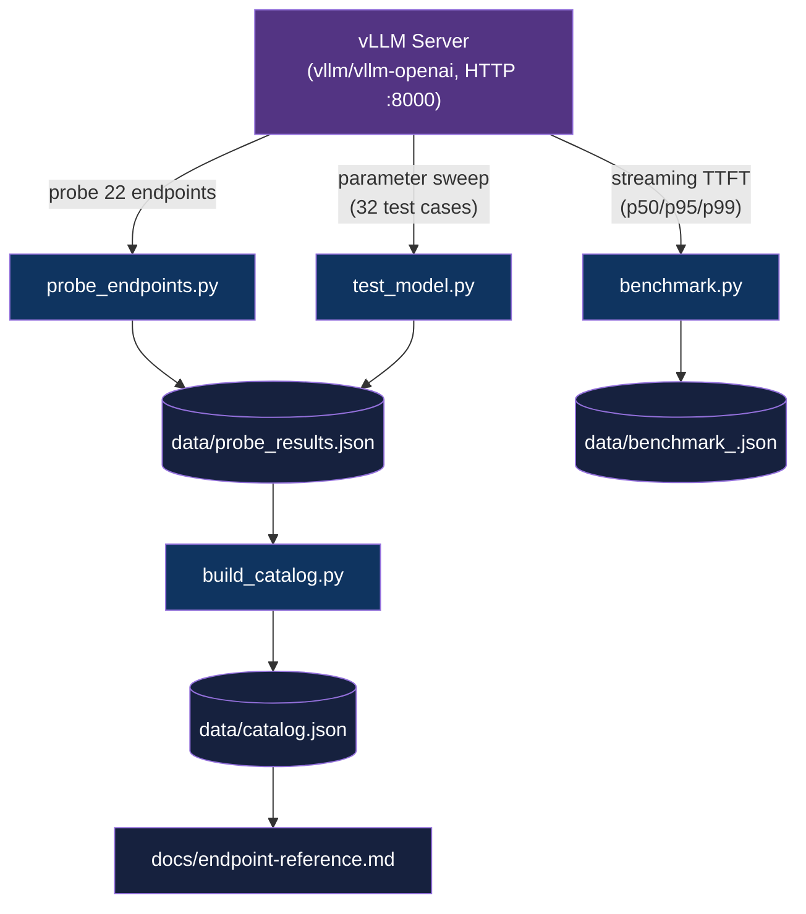

<div align="center">

# vLLM Explorer

[](https://www.python.org/downloads/)
[](LICENSE)

**Probes and catalogs the full vLLM server API: endpoint reference, model behavior, and performance benchmarks**

[Getting Started](#getting-started) | [Usage](#usage) | [Architecture](#architecture)

</div>

---

## Table of Contents

- [The Problem](#the-problem)
- [Features](#features)
- [Tech Stack](#tech-stack)
- [Architecture](#architecture)
- [Getting Started](#getting-started)
  - [Prerequisites](#prerequisites)
  - [Installation](#installation)
  - [Configuration](#configuration)
- [Usage](#usage)
- [How It Works](#how-it-works)
- [Results](#results)
- [Architectural Decisions](#architectural-decisions)
- [Project Structure](#project-structure)
- [Related Projects](#related-projects)
- [License](#license)
- [Author](#author)

## The Problem

### Undocumented vLLM API Surface

vLLM exposes 22+ HTTP endpoints across five categories (admin, OpenAI-compatible, tokenizer, pooling, LoRA), but the official docs lag behind vLLM releases. It is unclear which endpoints exist in a given version, what response shapes look like in practice, and how TTFT and throughput actually behave for a specific model on specific hardware.

### The Solution

vllm-explorer probes the full endpoint surface of a running vLLM server, sweeps model parameters to map behavior, and benchmarks TTFT and tokens/sec across prompt lengths. Results are written as JSON and a human-readable reference doc, capturing the live state of the API for a specific vLLM version and model combination.

## Features

- **Endpoint catalog** - probes all 22 known vLLM HTTP endpoints across 5 categories; logs status, latency, and response shapes to `data/probe_results.json`
- **Model parameter sweep** - tests 9 parameter dimensions (temperature, top-k, top-p, min-p, repetition penalty, structured output, streaming, stop sequences, seed); 32 test cases per model
- **TTFT/throughput benchmark** - measures time to first token (p50/p95/p99), end-to-end latency, generation tok/s, and prefill tok/s across short/medium/long prompts
- **Prometheus metrics reference** - maps the `/metrics` output for use in Grafana dashboards (KV cache, queue depth, prefix cache, preemption counts)
- **No vLLM SDK** - pure `httpx` against any running vLLM server; works across vLLM versions without SDK compatibility concerns

## Tech Stack

| Component | Technology |
|-----------|------------|
| Language | Python 3.12+ |
| HTTP client | httpx (async) |
| OpenAI-compatible client | openai |
| CLI output | rich |
| Config | python-dotenv |

## Architecture


```mermaid
graph TD
    A["vLLM Server\n(vllm/vllm-openai, HTTP :8000)"] -- "probe 22 endpoints" --> B["probe_endpoints.py"]
    A -- "parameter sweep\n(32 test cases)" --> C["test_model.py"]
    A -- "streaming TTFT\n(p50/p95/p99)" --> D["benchmark.py"]
    B --> E[("data/probe_results.json")]
    C --> E
    D --> F[("data/benchmark_<model>.json")]
    E --> G["build_catalog.py"]
    G --> H[("data/catalog.json")]
    H --> I["docs/endpoint-reference.md"]

    style A fill:#533483,color:#fff
    style B fill:#0f3460,color:#fff
    style C fill:#0f3460,color:#fff
    style D fill:#0f3460,color:#fff
    style E fill:#16213e,color:#fff
    style F fill:#16213e,color:#fff
    style G fill:#0f3460,color:#fff
    style H fill:#16213e,color:#fff
    style I fill:#16213e,color:#fff
```

## Getting Started

### Prerequisites

- Python 3.12+
- A running vLLM server (Docker with `nvidia-container-toolkit`, or bare-metal vLLM install)
- NVIDIA GPU with 8GB+ VRAM recommended

### Installation

1. Clone the repository:
   ```bash
   git clone https://github.com/adityonugrohoid/vllm-explorer.git
   cd vllm-explorer
   ```

2. Create and activate a virtual environment:
   ```bash
   python3 -m venv .venv
   source .venv/bin/activate
   ```

3. Install dependencies:
   ```bash
   pip install -r requirements.txt
   ```

### Configuration

```bash
cp .env.example .env
```

<details>
<summary>Configuration reference</summary>

```bash
# vLLM server base URL (default: local Docker on port 8000)
VLLM_BASE_URL=http://localhost:8000
```

</details>

Start vLLM before running any script:

```bash
docker run --gpus all \
  -p 8000:8000 \
  --ipc=host \
  vllm/vllm-openai \
  --model mistralai/Mistral-7B-Instruct-v0.2
```

Wait for `Application startup complete` (~30-60s) before running scripts.

## Usage

```bash
# Probe all 22 endpoints - logs status, latency, response shapes
python scripts/probe_endpoints.py

# Sweep model parameters (temperature, top-k, structured output, etc.)
python scripts/test_model.py --model Qwen/Qwen2.5-1.5B-Instruct

# Benchmark TTFT and tokens/sec across short/medium/long prompts
python scripts/benchmark.py --model Qwen/Qwen2.5-1.5B-Instruct --iterations 5

# Build full catalog across all scripts
python scripts/build_catalog.py
```

Results are written to `data/` as JSON and summarized to stdout via `rich`.

## How It Works

### 1. Endpoint probing

`probe_endpoints.py` builds a list of all 22 known vLLM endpoints with their expected request bodies, discovers the loaded model from `/v1/models`, then probes each endpoint sequentially. It extracts response shapes (keys and types, not values) and writes a structured JSON record per endpoint. Endpoints that require specialized model types (pooling, LoRA) are probed anyway to document availability vs. 404 behavior.

### 2. Parameter sweep

`test_model.py` sends the same test prompt across 9 parameter dimensions to map model behavior. Each sweep varies one parameter at a time (e.g., temperature 0.0 to 1.5 in steps) and records whether the request succeeds, what the response looks like, and whether determinism holds under fixed seed.

### 3. TTFT benchmark

`benchmark.py` uses HTTP streaming (`stream: true`) to measure time to first token precisely. It runs 5 iterations per prompt length (short ~10 tokens, medium ~60 tokens, long ~200 tokens), computes p50/p95/p99 TTFT, end-to-end latency, generation throughput (tok/s post-TTFT), and prefill throughput (prompt tok/s during TTFT window).

## Results

Results captured on vLLM v0.17.1 with `Qwen/Qwen2.5-1.5B-Instruct` on an RTX 4060 Laptop 8GB (WSL2, bfloat16, `--max-model-len 4096 --gpu-memory-utilization 0.8`):

### Endpoint availability (9/21 active)

| Category | Available | 404 | Skipped | Total |
|----------|-----------|-----|---------|-------|
| Admin | 3 | 1 | 0 | 4 |
| OpenAI | 4 | 1 | 2 | 7 |
| Tokenizer | 2 | 0 | 0 | 2 |
| Pooling | 0 | 6 | 0 | 6 |
| LoRA | 0 | 2 | 0 | 2 |

404s on pooling and LoRA are expected: pooling requires a specialized model type; LoRA requires `--enable-lora` at server start.

### TTFT benchmark

| Prompt | TTFT p50 | TTFT p95 | E2E p50 |
|--------|----------|----------|---------|
| Short (~10 tokens) | 48ms | 51ms | 427ms |
| Medium (~60 tokens) | 49ms | 54ms | 12,620ms |
| Long (~200 tokens) | 52ms | 60ms | 27,030ms |

TTFT is consistent across prompt lengths (48-52ms p50). E2E scales with output length, not input: the 1.5B model generates longer responses for complex prompts.

### Parameter sweep

32/32 test cases passed. All temperature, top-k, top-p, min-p, repetition penalty, structured output, streaming, stop sequence, and seed reproducibility tests confirmed working on `Qwen/Qwen2.5-1.5B-Instruct` under vLLM v0.17.1.

## Architectural Decisions

### 1. Pure HTTP, no vLLM SDK

**Decision:** Use `httpx` directly against the vLLM HTTP server rather than the vLLM Python SDK or any SDK wrapper.

**Reasoning:** The goal is to document the HTTP API surface exactly as a client sees it, including undocumented fields and version-specific 404s. The vLLM SDK abstracts away the HTTP layer and would hide the response shapes we are trying to capture. Pure HTTP also means the scripts work against any vLLM version and any server instance without SDK compatibility concerns.

### 2. Sequential probing, not concurrent

**Decision:** Endpoints are probed sequentially rather than in parallel.

**Reasoning:** Concurrent probes would interfere with TTFT and latency measurements. Sequential execution also avoids overwhelming a GPU inference server mid-benchmark, which would produce misleading throughput numbers.

### 3. Model auto-discovery

**Decision:** Scripts discover the loaded model ID from `/v1/models` at runtime rather than requiring it as a mandatory argument.

**Reasoning:** vLLM serves exactly one model per process. Auto-discovery reduces friction for iterative runs while still allowing `--model` override when needed.

## Project Structure

```
vllm-explorer/
├── scripts/
│   ├── probe_endpoints.py    # probe all 22 endpoints, log response shapes
│   ├── test_model.py         # parameter sweep (32 test cases)
│   ├── benchmark.py          # TTFT + tokens/sec across prompt lengths
│   └── build_catalog.py      # orchestrate all scripts, write data/catalog.json
├── docs/
│   ├── endpoint-reference.md # live probe results (generated)
│   └── vllm-api-reference.md # full API reference (compiled from docs + probing)
├── data/                     # runtime output (gitignored)
├── .env.example
├── requirements.txt
└── README.md
```

## Related Projects

| Project | Description |
|---------|-------------|
| [ollama-catalog](https://github.com/adityonugrohoid/ollama-catalog) | Ollama model catalog merging cloud API, OCI registry, and local instance into one filterable browser |
| [ollama-tool-calling-research](https://github.com/adityonugrohoid/ollama-tool-calling-research) | 32-model, 1,792-run benchmark of Ollama tool calling across native and text-based extraction layers |
| [nim-explorer](https://github.com/adityonugrohoid/nim-explorer) | NVIDIA NIM model catalog and capability probe with tool, JSON, and thinking support per model |
| [llm-voxel-arena](https://github.com/adityonugrohoid/llm-voxel-arena) | Interactive arena where open-source LLMs compete by building voxel structures via tool calling in a ReAct loop |
| [voxel-architect](https://github.com/adityonugrohoid/voxel-architect) | Agentic voxel builder with a 5-tool grid API, 128x128x128 sparse world, and layer-aware response parsing |
| [spatial-llm](https://github.com/adityonugrohoid/spatial-llm) | QLoRA fine-tuning of a 1.2B model on 7x7 grid spatial-design tasks, beating 1T+ baselines via memorization training |
| [open-layer](https://github.com/adityonugrohoid/open-layer) | Open spec for LLM inference I/O with NIM, DeepSeek, and Groq adapters plus a conformance test suite |

## License

This project is licensed under the [MIT License](LICENSE).

## Author

**Adityo Nugroho** ([@adityonugrohoid](https://github.com/adityonugrohoid))
